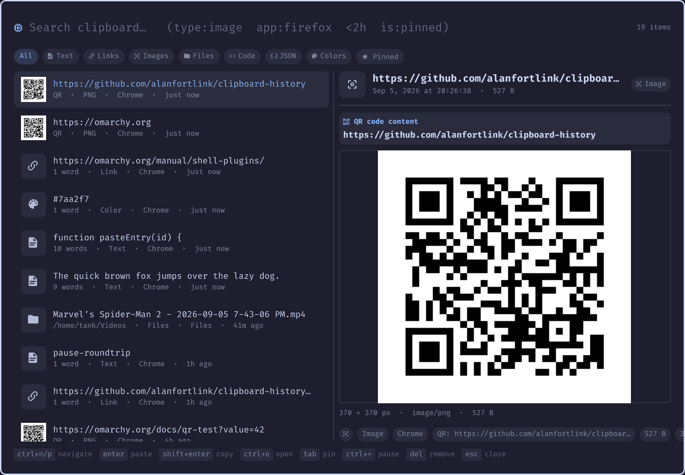
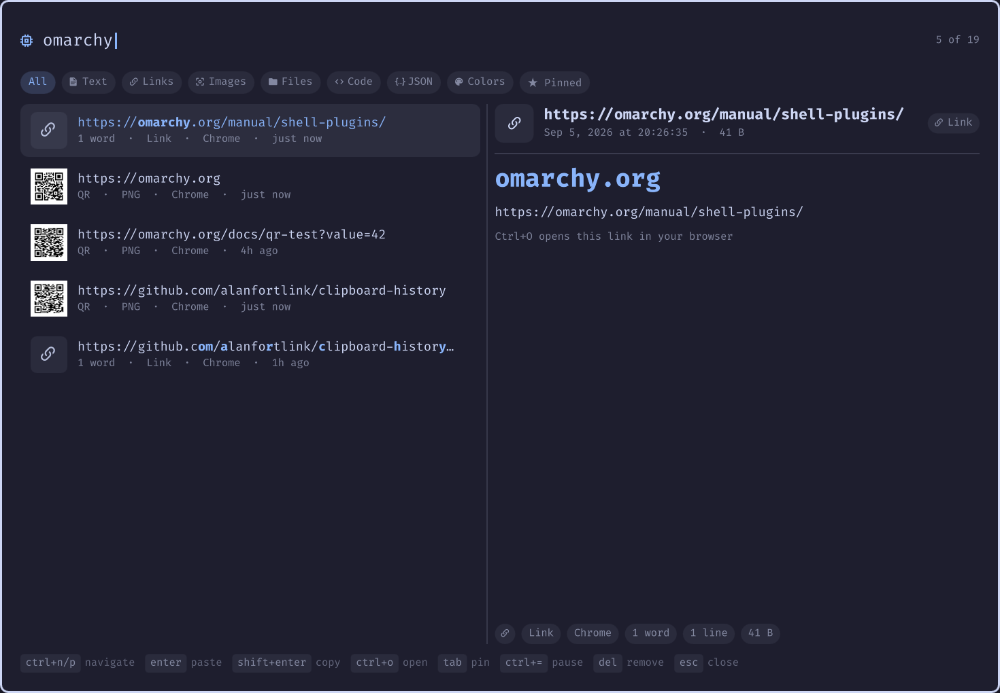

# clipboard-history

A Raycast/vicinae-style clipboard history manager for [Omarchy](https://omarchy.org),
built as an Omarchy shell plugin. Fuzzy search over everything (content, type,
source app, date — even text inside QR codes), rich per-type previews, and
full theme integration.

<p align="center">
  
</p>

## Highlights

- **Fuzzy search over everything** — fzf-style scoring across content, source
  app, and type, boosted by recency, pins, and usage. Query tokens:
  - `type:image|link|text|files|code|json|color|email|html|number` (prefix match)
  - `app:firefox` — fuzzy match on the source app
  - `is:pinned`, `today`, `yesterday`, `week`, `<2h`, `>30s`, `<3d`
- **Rich previews, per type** — images rendered inline, QR codes show their
  decoded content, colors show a swatch with hex/rgb/hsl, links show the
  domain, JSON is pretty-printed, file lists show paths — every preview with
  metadata chips (app, date, words/lines, size, paste counts)
- **QR codes** — copied QR images are decoded with `zbarimg`; the payload is
  shown in the list, preview, and is searchable like any text clip — and if it
  encodes a link, `Ctrl+O` (or the preview's "Open link" chip) opens it in the
  browser directly
- **OCR search** — captured images are OCR'd with `tesseract`, so text inside
  screenshots becomes fuzzy-searchable; the recognized text shows in the
  preview pane and as a metadata chip
- **Rich capture** — a `wl-paste --watch` daemon records every clip with mime
  type, byte size, source app (via `hyprctl`), timestamp, and image dimensions.
  Text, images, and `file://` URI lists (file-manager copies) are supported;
  password-manager clips and binary payloads are skipped
- **Retention control** — configure how much and how long history is kept
- **Pause/resume** — stop recording new copies without losing your history
- **Fully theme-integrated** — colors, spacing, corner radius, borders, and
  the monospace font all come from the Omarchy shell's theme singletons; it
  re-themes itself on `omarchy theme set`

<p align="center">
  
</p>

## Install

```bash
omarchy plugin add https://github.com/alanfortlink/clipboard-history.git --enable
```

Optional extras (usually already installed):

```bash
omarchy pkg add zbar tesseract tesseract-data-eng   # QR decode + OCR search
```

Already have images in history you'd like OCR'd? One-shot backfill:

```bash
python3 scripts/backfill-ocr.py          # add --lang deu for other languages
```

That's the whole install — `omarchy plugin add` clones the repo, validates the
manifest, and enables it. It replaces the built-in `omarchy.clipboard`
(restore it later with `omarchy plugin disable alanfortlink.clipboard`).

Omarchy's default `Super+Ctrl+V` (and `Super+Shift+V`) already routes to it
via the clone mechanism. For a custom binding, edit the **live** config —
`~/.config/hypr/bindings.lua` on Quattro (a plain `bindings.conf` may exist
but is not sourced):

```lua
o.bind("ALT + SHIFT + V", "Clipboard manager (clipboard-history)",
  "omarchy-shell shell toggle alanfortlink.clipboard")
```

(If your config is still legacy `bindings.conf`: `bindd = ALT SHIFT, V, …`.)

Updating: `omarchy plugin update alanfortlink.clipboard` · Uninstall: `omarchy plugin remove alanfortlink.clipboard`

## Keys

| Key | Action |
| --- | --- |
| `Ctrl+N` / `Ctrl+P` (or arrows) | navigate results |
| `Enter` | copy to clipboard and paste into the focused window |
| `Shift+Enter` | copy only |
| `Ctrl+O` | open (link → browser, image → editor, file → xdg-open, text → editor). QR images open their **decoded link** in the browser; the preview pane also has clickable "Open link" chips for links and QR payloads |
| `Tab` | pin/unpin |
| `Ctrl+=` | pause/resume recording |
| `Delete` | remove entry · `Shift+Delete` clear all (with confirm) |
| `Esc` | clear filter, then close |

Pause/resume is also scriptable — useful for automation or a custom binding:

```bash
omarchy-shell shell call alanfortlink.clipboard pause '{"paused":"toggle"}'
omarchy-shell shell call alanfortlink.clipboard isPaused
```

## Configuration

Settings live on the plugin's entry in the `plugins` array of
`~/.config/omarchy/shell.json` and hot-reload on save:

```json
{
  "version": 1,
  "plugins": [
    {
      "id": "alanfortlink.clipboard",
      "historyLimit": 1500,
      "maxAgeDays": 30,
      "maxRows": 200
    }
  ]
}
```

| Key | Default | Meaning |
|-----|---------|---------|
| `historyLimit` | `1500` | max entries kept in history |
| `maxAgeDays` | `0` (forever) | drop entries older than N days (images get garbage-collected; pinned entries are exempt) |
| `maxRows` | `200` | max rows the picker shows per search |
| `qrDecode` | `true` | decode QR codes with `zbarimg` on captured images |
| `ocr` | `true` | OCR captured images with `tesseract` (skipped automatically if not installed) |
| `ocrLang` | `"eng"` | tesseract language(s), e.g. `"deu"` or `"eng+deu"` — install packs with `omarchy pkg add tesseract-data-deu` |

History lives in `~/.local/state/omarchy/clipboard-history-rich.json`; image
blobs are content-addressed under `~/.local/state/omarchy/clipboard-images/`.

## How it compares

| | built-in `omarchy.clipboard` | [sspaeti's OCR fork](https://github.com/sspaeti/omarchy-clipboard-plugin) | [Clipbasket](https://github.com/clipbasket/clipbasket-omarchy) | vicinae | **clipboard-history** |
|---|---|---|---|---|---|
| Fuzzy search | substring | + OCR text | ✓ | ✓ | content + app + type + date tokens (`type:`, `app:`, `<2h`, `today`) |
| Previews | text/image | — | — | ✓ | images, **QR payloads**, color swatches, JSON pretty-print, links, files |
| Metadata | basic | basic | SQLite | ✓ | size, source app, dims, word/line counts, pins, paste counts |
| OCR search | ✗ | ✓ (forked for it) | ✗ | ✗ | ✓ (`ocr`, searchable + preview panel) |
| Retention config | 300 cap | limit | ✓ | ✓ | `historyLimit` + `maxAgeDays` + GC |
| Pause recording | ✗ | ✗ | ? | ✓ | ✓ (in-picker + IPC) |
| Theme-integrated shell overlay | ✓ | ✓ | ✓ | own | ✓ (uses Omarchy's theme singletons) |

## Roadmap / ideas

- `autoPaste` mode swap: Enter = copy-only, Shift+Enter = paste (walker-style)
- OCR language auto-detect / confidence thresholds
- Small bar widget: last-copied item + paused indicator
- Snippet editing: edit a pinned entry's content in place
- Multi-select delete, export/import of history
- Optional per-app capture exclusions beyond the password-manager hint

## Development

```
├── manifest.json      # plugin manifest (replaces omarchy.clipboard via clonedFrom)
├── Clipboard.qml      # picker overlay: search, chips, list, keys, capture watchers
├── PreviewPane.qml    # per-type preview + metadata chips
├── Store.js           # history model: dedup, pins, retention, settings parsing
├── Fuzzy.js           # query parser, fuzzy matcher, scoring, highlighting
├── Classify.js        # type detection, app names, formatting, color math
├── capture.py         # clipboard watcher → one JSON line per clip (QR + OCR)
├── paste-entry.sh     # copy + shift-insert paste into the focused window
├── open-entry.sh      # open with the right app
├── tests/             # node --test suites for the JS logic
└── scripts/           # screenshot regeneration helpers
```

- Run logic tests: `tests/run.sh`
- Validate the manifest: `omarchy plugin validate <checkout-dir>`
- Regenerate screenshots: `scripts/take-screenshots.sh` (stages demo content
  and captures the picker keyboard-free over IPC)
- Hot-reload after edits: `omarchy-shell shell rescanPlugins`

## License

[MIT](LICENSE)
